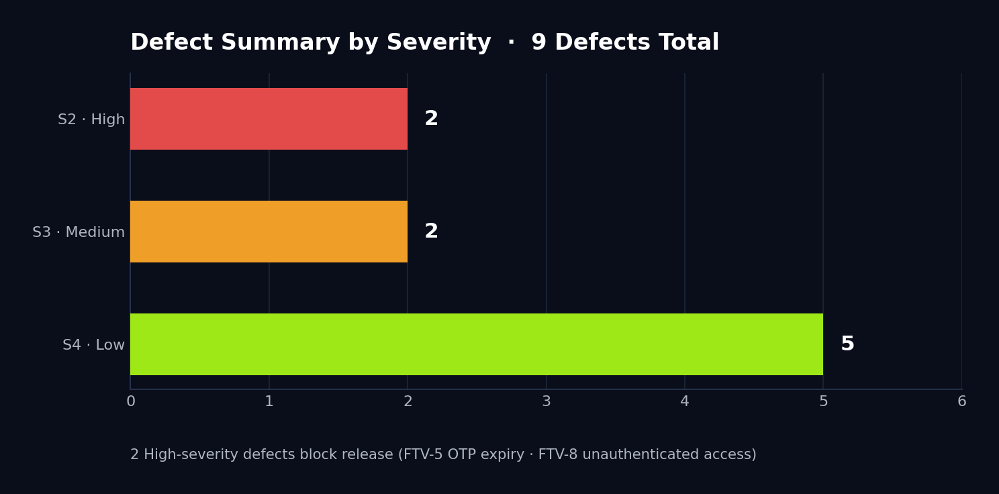
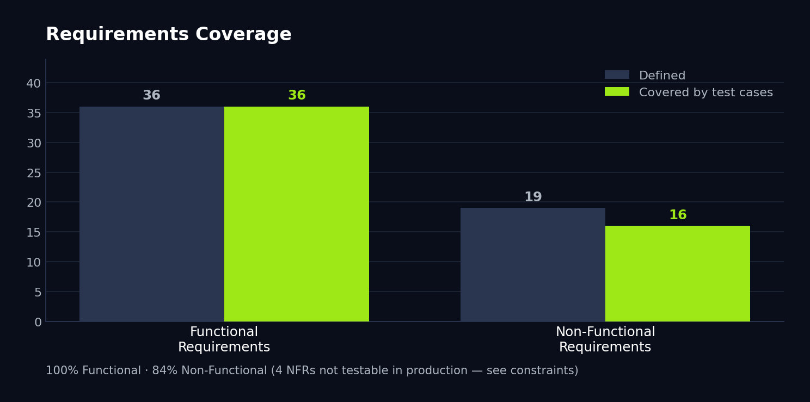

# FreeTV iOS — Full Cycle QA Project

### SRS · STP · STD · STR · API Testing · Security Disclosure

    

End-to-end manual QA project for the **FreeTV iOS streaming application**, covering the full QA lifecycle — requirements, test planning, design, execution, defect reporting, and final reporting — following IEEE 830 and IEEE 829 standards.

---

## 📋 Project Overview

| Field                 | Details                                  |
| --------------------- | ---------------------------------------- |
| **System Under Test** | FreeTV iOS App — v1.25.32 (build 142)    |
| **Test Type**         | Manual Functional, Non-Functional, API, Database |
| **Environment**       | Production                               |
| **Device**            | iPhone 14 Pro · iOS 26.3.1 · 4G          |
| **Standards**         | IEEE 830 (SRS) · IEEE 829 (STP/STD/STR)  |
| **Prepared by**       | Kirill Kovalevski                        |
| **Mentor**            | Gal Matalon                              |

---

## 📥 Full Documentation

📄 **[Download the full documentation (PDF)](FreeTV_QA_Documentation%20-%20Kirill%20Kovalevski.pdf)** — SRS, STP, STD, STR in a single 99-page file.

| Document | Standard | Description                                    |
| -------- | -------- | ---------------------------------------------- |
| SRS      | IEEE 830 | 36 Functional + 19 Non-Functional requirements |
| STP      | IEEE 829 | Test planning and strategy                     |
| STD      | IEEE 829 | 123 test cases with steps and evidence         |
| STR      | IEEE 829 | Full test results, RTM, defect summary         |

---

## 📊 Execution Summary

| Status     | Count |
| ---------- | ----- |
| ✅ Passed   | 99    |
| ❌ Failed   | 9     |
| ⏸️ Blocked  | 15    |
| ⏭️ Skipped  | 0     |
| 📋 Total   | 123   |

**Pass Rate: 80%** (91% excluding blocked database cases)

---

## 🧪 Results by Suite

| Suite          | Total | Passed | Failed | Blocked | Pass Rate |
| -------------- | ----- | ------ | ------ | ------- | --------- |
| Functional     | 71    | 67     | 4      | 0       | 94%       |
| Non-Functional | 19    | 16     | 3      | 1       | 80%       |
| API            | 18    | 16     | 2      | 0       | 89%       |
| Database       | 14    | 0      | 0      | 14      | N/A       |
| **Total**      | **123** | **99** | **9** | **15** | **80%**  |

> Database cases were defined to demonstrate data-integrity validation but blocked from execution due to production-environment constraints (no direct DB access).

---

## 🐛 Defect Summary

| Severity      | Count |
| ------------- | ----- |
| 🔴 S2 · High   | 2     |
| 🟠 S3 · Medium | 2     |
| 🟢 S4 · Low    | 5     |
| **Total**     | **9** |

### 🔴 High Severity

| ID    | Title                                                              | Requirement     |
| ----- | ------------------------------------------------------------------ | --------------- |
| FTV-5 | OTP remains valid for 60 minutes — industry standard is 10 minutes | FR-007, NFR-011 |
| FTV-8 | Multiple content endpoints accessible without authentication       | FR-013, NFR-010 |

### 🟠 Medium Severity

| ID    | Title                                                       | Requirement |
| ----- | ----------------------------------------------------------- | ----------- |
| FTV-7 | Internal system architecture exposed in API error responses | NFR-010     |
| FTV-9 | Playback position not restored after app force-close        | NFR-020     |

### 🟢 Low Severity

| ID    | Title                                                        |
| ----- | ------------------------------------------------------------ |
| FTV-1 | Profile name truncation inconsistency                        |
| FTV-2 | Silent blocking — no error feedback for invalid phone number |
| FTV-3 | Special characters accepted without error feedback           |
| FTV-4 | Search history cleared without confirmation prompt           |
| FTV-6 | CATCH UP category label displayed in English                 |

> ⚠️ **Responsible Disclosure:** Security findings (FTV-7, FTV-8) have been reported to the FreeTV development team. Sensitive endpoint URLs and internal architecture details are withheld from public documentation.

---

## 🔍 Testing Areas

- Onboarding & Authentication
- Live TV Streaming
- VOD & Catch-Up Content
- Search & Search History
- Watchlist Management
- Profile Management (multi-profile)
- Navigation
- API Endpoints (auth, content, search, watchlist)
- Database-related Validation
- Performance, Security, Compatibility, Localization, Recovery

---

## 🛠️ QA Methodologies

- Positive / Negative Testing
- Boundary Value Analysis (BVA)
- Equivalence Partitioning
- Exploratory Testing
- Edge Case Testing
- Risk-based Testing

---

## 🧰 Tools Used

| Tool          | Purpose                                          |
| ------------- | ------------------------------------------------ |
| TestRail      | Test case management — 123 cases across 4 suites |
| JIRA          | Bug tracking — 9 defects filed                   |
| Fiddler       | API traffic capture and analysis                 |
| Postman       | API request replay and validation                |

### Key API Discoveries

- OTP validation endpoint uses **PUT** method (not POST as originally assumed)
- **4 simultaneous search requests** fire on each keystroke (search-as-you-type)
- Content endpoints return **200 OK without authentication** — security vulnerability
- Watchlist endpoint correctly enforces **device-level authentication**

---

## 🚦 Release Recommendation

> **NOT RECOMMENDED FOR RELEASE** in the current state. Two High-severity defects must be resolved and retested first: FTV-5 (OTP validity period) and FTV-8 (unauthenticated content access).

---

## 🗂️ Sample Defect Documentation

Each defect was logged in JIRA with severity, priority, related requirement, environment, reproduction steps, expected vs. actual results, and annotated screenshot/video evidence.

**FTV-5 · High Severity** — OTP remains valid far beyond the industry standard (release blocker):

**FTV-4 · Low Severity** — with annotated on-device screenshot evidence:

---

## 📊 Test Execution Results

---

## 👤 Author

**Kirill Kovalevski** — QA Engineer

**Mentor:** Gal Matalon · **Institution:** המכללה לאוטומציה · **Duration:** April — June 2026
